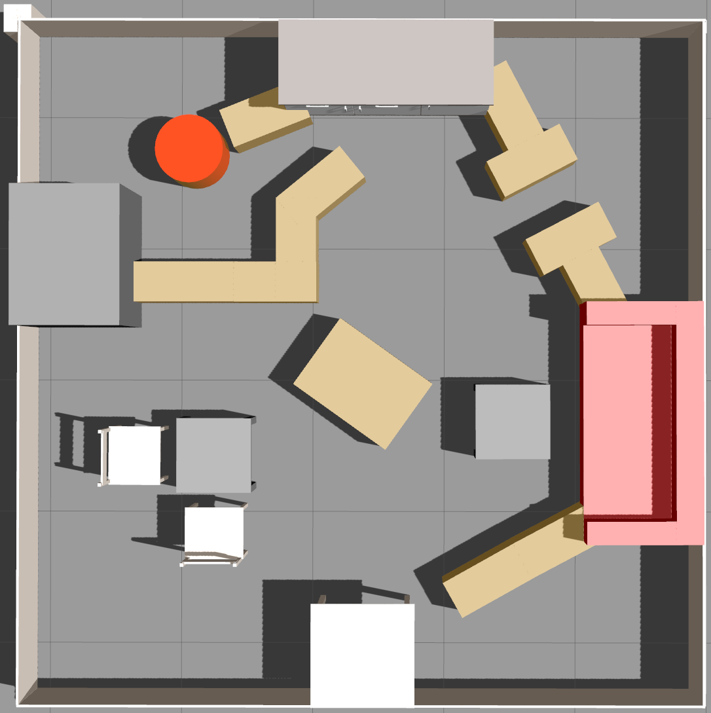
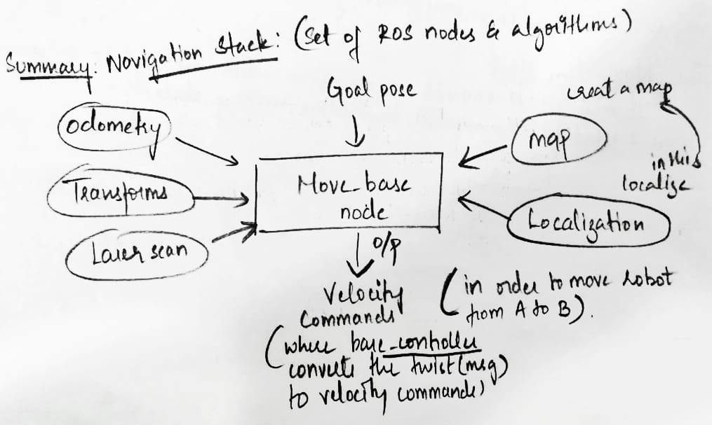

# Autonomous-Mobile-Robotics
Turtlebot navigation in Gazebo environment by avoiding obstacles and collision between the multiple robots
# AMR FINAL PROJECT

[[_TOC_]]

## Team details

Team name : **RCB**

Name:`ABHISHEK SHIVAYYA`   
Matriculation Number: `32938`   
ID :`@as-192113`   

## Objective

I have given a practice arena, in this arena I have to reach the goals published by the `goal_publisher` package. The aim is to reach all the goals and collect the reward provided to each goal in arena within 10 minutes by avoiding the obscatcles using `move_base` package.

The training arena looks like

## Short Description

As the aim is to collect the maximum reward points I came up with sorting algorithm which is based on the cost function wihch is dependent on global path distance and rewards. I subscribed to amcl and move_base nodes to navigate through the environment. AMCL (adaptive Monte Carlo localization) package has amcl node which takes in a laser-based map(/map), laser scans(/scan), and transformations of robots(/tf), and estimates position in the map . The move_base node acts like a simple action server links together a global and local planner to accomplish its global navigation task. In this project I used default global and local planners i.e Navfn as base global planner and DWA (Dynamic Window Approach) planner as base local planner.

## Sorting algorithm

- Subscribing to the `/goals` topic and storing all the goals and its respective rewards in seperate list using msg.goals.
- Calculating the distance of each goal point from the current position to all the goal points using the euclidian distance and storing these values in list.
- Calculating the sum of rewards, distance and Normalize both rewards and distances list.
- Calculating the cost value by dividing normalized distance by normalized reward for each goal points and store them in separate list.
- Make the list of tuple (goal point, rewards, cost value and distance).
- Sort the list by using the cost value using lambda function as key.
- When action client is called, the first goal point from the sorted list is appended to list goal_point and send to move_base as the input goal.
- This cycle repeats untill the remaining_goal list and cancelled_goal list empty.

## Move_Base Package

- move_base package contains a node called move_base node , which works like simple action server
- The main function of the move_base node is to move the robot from its current position to a goal position i.e. providing the trajectory.
- This node takes a goal pose with msg type geometry_msg/Pose stamped
- This Action server provides the topic move_base/goal from which it receive goals.
- When the node receives the goal pose. it links to components such as global planner, local planner, recovery behavior and costmaps and generates an output which is velocity command with msg type     geometry_msg/Twist() ie from cmd_vel topic.

## AMCL(adaptive Monte Carlo Localization) Package

As I know the robot may not always moves as we expected, it makes some random guesses to move to next position. These random guesses are called particles(the green arrows that appear under the robot in rviz).The robot observes environment and discards particles that doesn't match with the readings and generates more particles towards the probable one.The more I move the robot, the more data from sensors and localization will be more precise. MCL Localization is also called particle filter localization.

The amcl (Adaptive Monte Carlo Localization)node:
This node subscribe to the data of laser(/scan), the laser based map(/map), the transformations of robot (/tf) and publishes to the position in the map using topic (/amcl_pose)

## Global and Local Planners

### Global Planners

When a new goal is received by the move_base,this goal is immediately sent to the global planner then the global planner is incharge of calculating safe path in order to arrive at the goal position. The path is calculated before the robot moves to the goal. So, it will not take into account the readings that the laser scaner are doing while moving.Ech time new path planned by global planner is published into topic (/path).There are different global palnners like `carrot_planner`, `sbpl_lattice_planner` and `navfn_planner`. As per requirements of our project `navfn_planner` is the best suited and most used as well. The Carrot planner allows the robot to get as close to a user-specified goal point as possible. It can be used in situation where the goals are present on the obstacle.

### Local Planners
I came across `teb_Local_planner` (Timed Elastic Band) and `dwa_local_planner`(Dynamic Window Approach). Afer testing and changing some of the parameters using ROS dynamic reconfigure finally I selected dwa local planner for our project. 

## Selecting the parameters

When trying to reach goal point with reward 150, I had to go through narrow path which is almost equal to the diameter of turtlebot3. I tried reaching the goal point using different `cost scaling factor (CSF)` and `inflation radius (IR)` values.
Change the xy goal tolerance to 0.25 and yaw goal tolerance to 3.13 so that it will be helpful for us to reach the goal if there is another bot is already present at the same goal.

cost scaling factor (CSF) : 5.0  
inflation radius (IR):  0.2  
yaw_goal_tolerance: 3.13  
xy_goal_tolerance: 0.25  
latch_xy_goal_tolerance: false  
 
